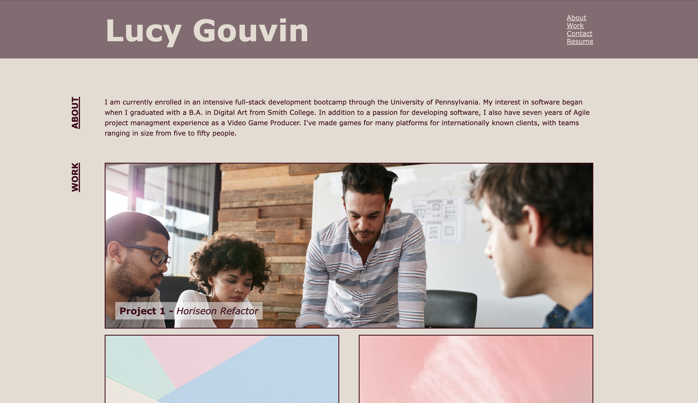
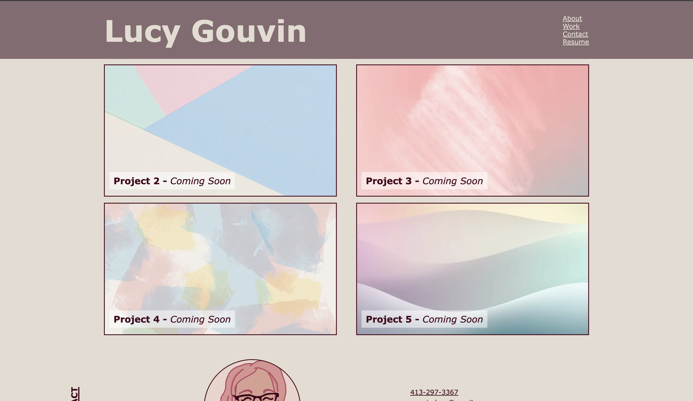

# Lucy Gouvin Portfolio Site

## Description

This is the first iteration of a professional portfolio site, which I can give to potential employers. The site is itself an example of my experience with responsive HTML and CSS, and also links out to other examples of my work. 

## Installation

The site is available here: [https://lucygouvin.github.io/portfolio-site/](https://lucygouvin.github.io/portfolio-site/)

## Usage

The site is hosted on GitHub pages, accessible here: [https://lucygouvin.github.io/portfolio-site/](https://lucygouvin.github.io/portfolio-site/)

Features include: 
- Sticky header, which is always visible as you scroll the portfolio
- Smooth animation when scrolling to sections via the nav links
- Rotated h2 elements for distinctive styling to showcase use of CSS
- Links change color when hovered
- Images in the Work section zoom slightly when hovered
- Links in Work section get an underline when hovered
- Responsive styling using a combination of Flexbox and media queries
- Link to a pdf of current resume
- Links to directly call or email
- Links to GitHub and LinkedIn profiles
- Links to past projects

## Credits

I consulted these tutorials/forums for guidance on how to achieve some of the more complicated techniques:
- [Vertical rotation of h2 elements](https://stackoverflow.com/questions/40205702/how-to-write-vertical-text-from-bottom-to-top-without-using-transform-rotate)
- [Sticky header](https://codelibrary.opendatasoft.com/components/sticky-header/#code-sticky-content-example-css-content)
- [Zoom image on hover](https://cssdeck.com/blog/zoom-images-inside-the-container-on-mouse-over-using-css/)
- [Object-fit and object-position usage](https://www.digitalocean.com/community/tutorials/css-cropping-images-object-fit)

Project placeholder images were found online, using here for educational purposes under the Copyright Act Fair Use provision. 
Avatar image is an original drawing, I am the sole copyright owner. 

## License

The last section of a high-quality README file is the license. This lets other developers know what they can and cannot do with your project. If you need help choosing a license, refer to [https://choosealicense.com/](https://choosealicense.com/).
